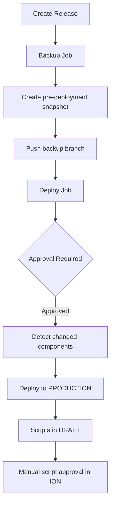
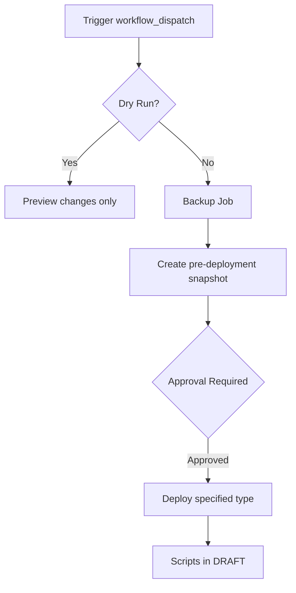

# CI/CD Workflows

Documentation for GitHub Actions workflows that automate ION component deployments.

## Table of Contents

- [Overview](#overview)
- [Workflow Files](#workflow-files)
- [Deploy to Test](#deploy-to-test)
- [Deploy to Production](#deploy-to-production)
- [Backup Workflow](#backup-workflow)
- [Required Secrets](#required-secrets)
- [Environment Protection](#environment-protection)
- [Deployment Flow](#deployment-flow)

---

## Overview

The CI/CD pipeline consists of three workflows:

| Workflow | Trigger | Purpose |
|----------|---------|---------|
| **deploy-test.yml** | Pull Request | Preview changes in TEST |
| **deploy-production.yml** | Release | Deploy to PRODUCTION |
| **backup.yml** | Daily schedule | Backup PRODUCTION to Git |

```
┌─────────────────────────────────────────────────────────────────┐
│                        CI/CD PIPELINE                           │
├─────────────────────────────────────────────────────────────────┤
│                                                                 │
│   PR Created ──► Validate ──► Deploy to TEST                   │
│                                    │                            │
│   PR Merged ───────────────────────┘                            │
│                                                                 │
│   Release Created ──► Backup ──► Approval ──► Deploy to PROD   │
│                                                                 │
│   Daily 2AM ──► Export PROD ──► Commit to Git                  │
│                                                                 │
└─────────────────────────────────────────────────────────────────┘
```

---

## Workflow Files

Located in `.github/workflows/`:

| File | Description |
|------|-------------|
| `deploy-test.yml` | PR preview deployment to TEST |
| `deploy-production.yml` | Production deployment with safety controls |
| `backup.yml` | Automated daily backup |

---

## Deploy to Test

**File:** `.github/workflows/deploy-test.yml`

### Trigger

- Pull requests to `Production` branch
- Changes in `ion-components/` folder
- Manual trigger (workflow_dispatch)

### Process

1. **Detect Changes** - Identifies modified component files
2. **Validate** - Runs component validation
3. **Deploy** - Deploys changed components to TEST
4. **Comment** - Posts deployment summary on PR

### Features

- Only deploys changed files (not all components)
- Validates components before deployment
- Auto-approves scripts in TEST (for quick iteration)
- Comments results on the PR

### Manual Trigger

```yaml
workflow_dispatch:
  inputs:
    component_type:
      description: 'Component type to deploy'
      required: false
```

---

## Deploy to Production

**File:** `.github/workflows/deploy-production.yml`

### Trigger

- Release published
- Manual trigger (workflow_dispatch)

### Safety Features

| Feature | Description |
|---------|-------------|
| **Pre-deployment Backup** | Creates snapshot before any changes |
| **Environment Protection** | Requires manual approval |
| **Concurrency Lock** | Prevents simultaneous deployments |
| **No Auto-Approve** | Scripts stay in DRAFT for review |
| **Required Component Type** | Manual deploys must specify type |
| **Dry Run Default** | Manual triggers default to dry-run |

### Process

```
1. Pre-deployment Backup
   └── Export current production state
   └── Create backup branch
   └── Push to repository

2. Wait for Approval
   └── GitHub environment protection
   └── Requires designated reviewer

3. Deploy
   └── Release: Deploy only changed files
   └── Manual: Deploy specified component type
   └── Scripts remain in DRAFT status

4. Summary
   └── Deployment status report
   └── Script approval reminder
   └── Rollback instructions (if failed)
```

### Manual Trigger Options

| Input | Description | Required |
|-------|-------------|----------|
| `component_type` | Type to deploy | Yes |
| `items` | Specific component names | No |
| `dry_run` | Preview only | No (default: true) |
| `skip_backup` | Skip pre-deployment backup | No (default: false) |

### Rollback on Failure

If deployment fails, the workflow provides rollback instructions:

```bash
# Option 1: Use rollback command
ion-cicd rollback --branch backup/pre-deploy-YYYYMMDD-HHMMSS --env prd

# Option 2: Manual restore from backup branch
git checkout backup/pre-deploy-YYYYMMDD-HHMMSS
ion-cicd deploy --all --env prd
```

---

## Backup Workflow

**File:** `.github/workflows/backup.yml`

### Trigger

- Daily at 2:00 AM UTC (configurable)
- Manual trigger (workflow_dispatch)

### Process

1. **Export** - Export all components from PRODUCTION ION
2. **Commit** - Create backup branch with changes
3. **PR** - Create pull request with changes
4. **Merge** - Auto-merge if no conflicts

### Backup Branch Naming

```
backup/prd-YYYYMMDD-HHMMSS
```

Example: `backup/prd-20240115-020000`

### Customize Schedule

Edit the cron expression in `backup.yml`:

```yaml
on:
  schedule:
    # Daily at 2:00 AM UTC
    - cron: '0 2 * * *'

    # Every 6 hours
    # - cron: '0 */6 * * *'

    # Weekdays only at 3:00 AM
    # - cron: '0 3 * * 1-5'
```

---

## Required Secrets

Configure these in **Settings** → **Secrets and variables** → **Actions**:

| Secret | Description | Used By |
|--------|-------------|---------|
| `IONAPI_CONFIG_TST` | Base64-encoded TST credentials | deploy-test.yml |
| `IONAPI_CONFIG_TRN` | Base64-encoded TRN credentials | (optional) |
| `IONAPI_CONFIG_PRD` | Base64-encoded PRD credentials | deploy-production.yml, backup.yml |

### Encoding Credentials

**macOS:**
```bash
base64 -i credentials/PRD.ionapi | pbcopy
```

**Linux:**
```bash
base64 -w 0 credentials/PRD.ionapi | xclip -selection clipboard
```

**Windows:**
```powershell
[Convert]::ToBase64String([IO.File]::ReadAllBytes("credentials\PRD.ionapi")) | Set-Clipboard
```

---

## Environment Protection

### Setup

1. Go to **Settings** → **Environments**
2. Create `production` environment
3. Configure protection rules:

| Setting | Recommended |
|---------|-------------|
| Required reviewers | 1-2 team members |
| Wait timer | 0 minutes |
| Deployment branches | `Production` only |

### How It Works

When a production deployment is triggered:

1. Workflow reaches the `deploy` job
2. GitHub pauses and requests approval
3. Designated reviewers are notified
4. Deployment proceeds only after approval

### Approval Notifications

Reviewers receive:
- Email notification
- GitHub notification
- Link to review deployment

---

## Deployment Flow

### Standard Flow (Release)



### Manual Deploy Flow



### Script Approval

After production deployment, scripts require manual approval in ION:

1. Log into Infor ION Desk
2. Navigate to **Connect** → **Scripts**
3. Find deployed scripts (status: DRAFT)
4. Review and click **Approve**

This ensures:
- Human review of script changes
- Testing in ION before activation
- Audit trail of approvals

---

## Troubleshooting

### Workflow Not Triggering

- Check trigger conditions (branch, paths)
- Verify secrets are configured
- Check workflow file syntax

### Deployment Fails

- Review job logs in GitHub Actions
- Check backup branch for pre-deployment state
- Use rollback instructions from summary

### Approval Not Requested

- Verify `production` environment exists
- Check environment is referenced in workflow
- Confirm protection rules are configured

### Backup Fails

- Check `IONAPI_CONFIG_PRD` secret
- Verify service user has export permissions
- Review ION API connectivity
